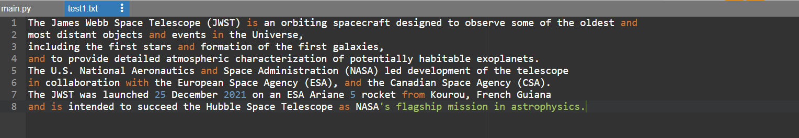
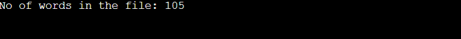

# Word-count
## AIM:
To write a python program for getting the word count from a text.
## EQUIPEMENT'S REQUIRED: 
PC
Anaconda - Python 3.7
## ALGORITHM: 
### Step 1:
Open the file in read access mode.
### Step 2: 
Intialize a variable with 0(word).
### Step 3: 
Iterate the content of the file using for loop.
### Step 4:  
Split the contents into each line using .split() function
### Step 5: 
Iterate the list of lines and increment the value of variable (word) each time
### Step 6: 
Print the program.
## PROGRAM:
```
with open("test1.txt","r") as fp:
    count=0
    for data in fp:
        l=data.split()
        for i in l:
            count+=1
    print("No of words in the file:",count)
```
### text.txt:

### OUTPUT:



## RESULT:
Thus the program is written to find the word count from a text.
